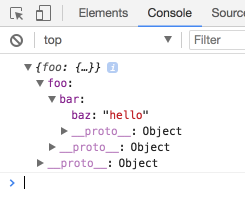

# How to debug JavaScript?

> If you're happy using `console` clap your hands! 👏

I know there are many tutorials about this topic on the internet. However I still get asked this question quite a lot from non JavaScript developers whenever they need to write some JavaScript code: _"How do I actually debug my JavaScript code?"_

I guess they ask, because they found old resources about this topic or they found resources which use a different tooling or they found a tutorial for debugging JavaScript inside the browser, but not Node or... There are probably many reasons. So here is my attempt to answer their question.

In this article you'll get

- a _short_ introduction to debugging JavaScript
- references to more in-depth explanations
- examples for debugging JavaScript in the browser _and_ in Node
- examples with and without tooling<sup>1</sup>

<sup>1</sup> Tooling refers to our setup here at [Mercateo](https://github.com/Mercateo). We use our [`ws` tool](https://github.com/Mercateo/ws) (which uses TypeScript, Babel, Webpack and more) for building our projects and many of our developers use [VS Code](https://code.visualstudio.com/) as their IDE.

You'll **not** get

- a basic introduction to JavaScript itself
- explanations about memory and performance profiling
- explanations about debugging non JavaScript stuff in your application (CSS, HTML, network...)
- explanations about configuring tools (e.g. for source map support)

# Table of contents

1. [Don't fear the `console`](#dont-fear-the-console)
    1. [A simple web project](#a-simple-web-project)
    1. [A more complex web project](#a-more-complex-web-project)
    1. [Web projects with a build setup](#web-projects-with-a-build-setup)
1. [Leverage breakpoints](#leverage-breakpoints)
1. [Debugging in VC Code](#debugging-in-vs-code)
1. [Advanced topics](#advanced-topics)

# Don't fear the `console`

## A simple web project

Hands down. I use the `console` for 90% of my debugging needs. It just fits my habbits well and most of the time I immediatelly see what's the problem. I don't know why many people feel _bad_ about using the `console` for debugging purposes. Probably because in other programming languages printing to the console lacks a lot of features. Thankfully the console is really powerful in JavaScript - _espacially_ for browser environments.

Let's get started with a very simple example.

```html
<!DOCTYPE html>
<html>
<head>
  <meta charset="utf-8">
  <title>Debugging JavaScript</title>
</head>
<body>
  <h1>Debugging JavaScript</h1>
  <p>Open you browser dev tools to see the console output.</p>
  <script src="./index.js"></script>
</body>
</html>
```

```js
var someObject = {
  foo: {
    bar: {
      baz: 'hello'
    }
  }
};

console.log(someObject);
```

The same example can be found inside [`./browser-console`](./browser-console). Just open in the HTML with a browser of your choice and open the browser console.

💡 All mordern browsers have usually everything you need for basic debugging purposes. But this was not allways the case and some special developer tools are still better in browser _X_ than in browser _Y_. Historically _most_ developers I know use Google Chrome for debugging their applications. But I'd like to point out Firefox which has awesome developer tools as well. Espacially the debugger called [`debugger.html`](https://github.com/devtools-html/debugger.html) itself is nice, because it is a standalone web application written in React.

This is how the browser with the open console looks like in Chrome:


And this is Firefox:


As you can see you get the basic object printed to the console (**1**) and you can see the origin of the output (**2**) as `script-name:row(:column)`. Note that **1** and **2** are _interactive_ elements. (Also note that I'll use screens from Chrome from now on - except when I'd like to point out something special in the Forefox debugger.)

If you click on **1** you can navigate into the object and you can also see properties which we didn't added, because they are on our objects [`prototype`](https://developer.mozilla.org/en-US/docs/Web/JavaScript/Inheritance_and_the_prototype_chain) (in this case just [`__proto__`](https://developer.mozilla.org/en-US/docs/Web/JavaScript/Reference/Global_Objects/Object/proto)).



If you click on **2** you'll jump to the "sources panel" in Chrome or "debugger panel" in Firefox where you can inspect the source code and create breakpoints.


We'll spend more time here in the next chapter. For now let's stick with the console.

## A more complex web project

Let us swith to a more complex project now which you can find in [./browser-console-complex](./browser-console-complex) or by copying the following code:

```html
<!DOCTYPE html>
<html>
<head>
  <meta charset="utf-8">
  <title>Debugging JavaScript</title>
</head>
<body>
  <h1>Debugging JavaScript</h1>
  <p>Open you browser dev tools to see the console output.</p>

  <button id="log-element">Log element</button>
  <button id="log-time">Log time</button>

  <script src="./index.js"></script>
</body>
</html>
```

```js
var logElementButton = document.getElementById('log-element');
logElementButton.addEventListener('click', function onClick(event) {
  console.log(event, logElementButton);
  console.dir(logElementButton);
});

var logTimeButton = document.getElementById('log-time');
logTimeButton.addEventListener('click', function onClick(event) {
  var msg = 'getBoundingClientRect().height';
  console.time(msg);
  logTimeButton.getBoundingClientRect().height;
  console.timeEnd(msg)
});
```

Open the `index.html` again and click on the _"Log element"_ button. It should look like this:


Here we can notice a couple of things.

1. `console.log` can log as much params as you want (here: `event` and `logElementButton`).
2. The logged `event` is labeled with a descriptive `MouseEvent`, which is the name of its [constructor](https://developer.mozilla.org/en-US/docs/Web/JavaScript/Reference/Global_Objects/Object/constructor).
3. If you `console.log` a DOM element it is logged as "HTML markup".
4. There are multiple ways to log a variable. `console.dir` is another one which logs the DOM element as an interactive list of its properties.

That's all we can see from the screenshot alone, but there is more under the hood.

If you hover over the `console.log`ed DOM element the element will actually be highlighted in the screen, but not for `console.dir`. You can also right click on the logged DOM element (via `console.log` or `console.dir`) and click on "Reveal in Elements panel" to jump to exactly this element in the DOM view.


If you right click on the `console.dir`'ed element you can also see the option to "Store as global variable". (This should work in nearly all cases, not just for logged DOM elements. Not sure why this isn't an option in the `console.log`'ed DOM element.)


Now you can access this global var (in my case its called `temp1`) as often as you want in your console. For example we could just add another event listener to it and use a new console method called `count` while doing so:

```js
temp1.addEventListener('mouseover', function onHover() { console.count('hovered'); })
```


If you hover over our _"Log element"_ button you should see the new output. `count` just counts how often the line `'hovered'` was logged.


If you console gets cluttered by too much output just click the stop icon in the left top corner to clear you current console (or call `console.clear()`).


Now press our _"Log time"_ button a couple of times. You should see an unput similar to this:


As you can see we made some basic performance testing with `console.time` and `console.endTime`. While this is definitely not for complex scenarios you can already gather useful information from these methods. (E.g. we can see that `getBoundingClientRect().height` gets faster over time - probably because the data gets cached and optimized when we run this function multiple times without altering our layout.)

💡 The difference we saw in `console.log` and `console.dir` can be seen in a lot of places - not just DOM elements. In general the `log` represantation is a simpler view ("stringified") while the `dir` representation is more useful, if you wan't to do _more_ with the variable besides reading.


💡 In many small cases Firefox behaves differently than Chrome here and other browsers will have their own distinct behaviour, too. Try out different tools and see what fits you. In Firefox the difference between `console.log` and `console.dir` is _way_ less explicit. It just alter the initial "look" of the logged variable, but we can swith between the `log` und `dir` represantation on the fly. It is also possible here to store the `console.log`'ed DOM element as a globar variable and the DOM element is highlighted when we hover of the `console.dir`'ed DOM element as well. IMHO Firefox behaviour is more usefull in these cases.

There is much more to discover about the console alone. Checkout the official documentation about the console from [Chrome](https://developers.google.com/web/tools/chrome-devtools/console/) and [Firefox](https://developer.mozilla.org/de/docs/Web/API/Console).

## Web projects with a build setup

Many JavaScript projects use a build step. You use Webpack, TypeScript, Babel or any other compiler/transpiler/preprocessor. The point is: the code you wrote is not necessarly the code that runs inside the browser or Node. Therefor the lines you see in your logs and stack traces don't match the places where they appear in your source code. Thankfully there is a technology to solve that: [Source Maps](https://www.html5rocks.com/en/tutorials/developertools/sourcemaps/). Source Maps an enable debugging tools to match the compiled code back to your original source code. This feature should be enabled in your tooling setup.

Just a quick example which you can find inside [./browser-console-build](./browser-console-build). This is the old example just "converted" to TypeScript and build with our [`ws` tool](https://github.com/Mercateo/ws). Install dependencies with `$ yarn` and run it with `$ yarn start`.

Now you should see your `.ts` file - **not** the `.js` file - in the console output.


What the `ws` tool does is basically configure TypeScript, Babel, Webpack and co. correctly to include Source Maps in your compiled code.

We'll move on to breakpoints now.

# Leverage breakpoints

***TODO***

# Debugging in VS Code

***TODO***

# Advanced topics

***TODO***

---

Thank you for reading so far ♥ I hope you learned something new on the way.

If you found any errors or typos I'd be happy to get a PR.
